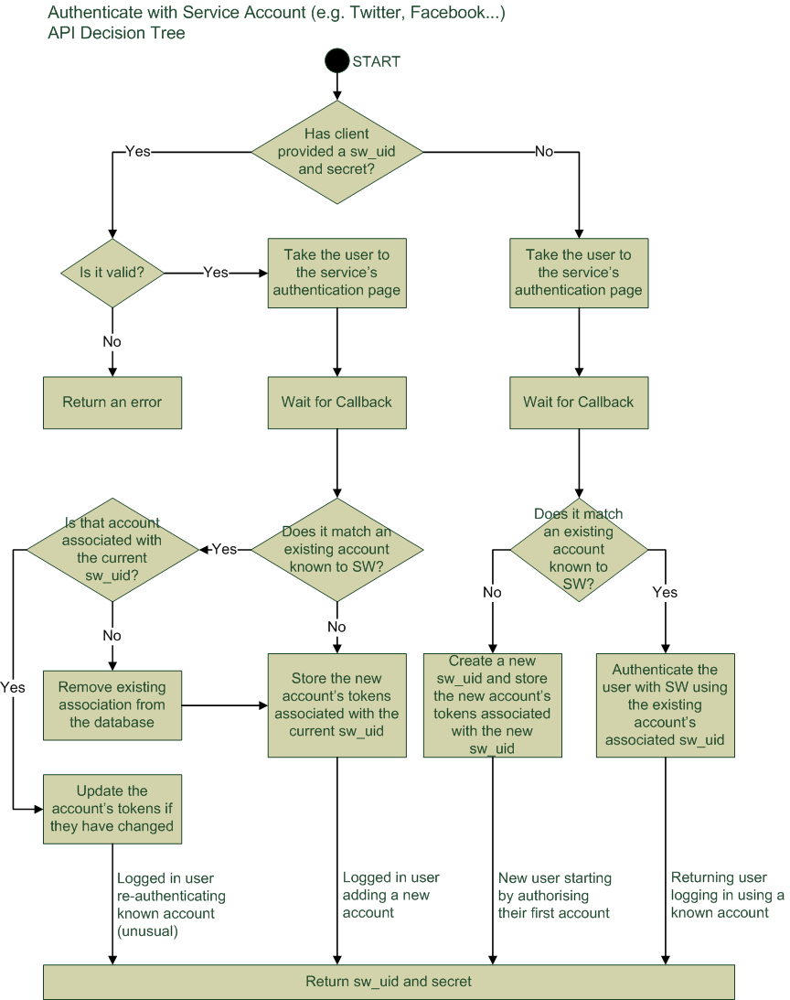

How does authentication work in SuccessWhale?
=============================================

Basic Introduction
------------------

Most of SuccessWhale's API calls require the user to be authenticated. (The exceptions are "Authenticate using [SuccessWhale|Twitter|Facebook|LinkedIn]".) A client supplies the API with two things in order to use a call that requires authentication:
* A SuccessWhale user ID (often abbreviated "sw_uid")
* A secret token generated by SuccessWhale, that must be repeated back to it.

Each of the authentication API calls will return these two values, and for applications that accept cookies, these calls will also save a cookie with these values in it. Applications that do not accept cookies will have to manually supply the user ID and secret token as parameters to all subsequent calls.

That doesn't sound too bad?
---------------------------

The complication comes because of the way SuccessWhale handles accounts. Each user has a sw_uid, which is used to tie together multiple accounts on different services. Optionally, that sw_uid may have a username and password associated with it, so that users can authenticate directly with SuccessWhale, but this is not mandatory.

So the following must be possible:
* **New users can auth with a service** (e.g. Twitter) and be set up with a new SuccessWhale account with that account linked to it.
* **Returning users can auth with the same service** and be logged into their existing SuccessWhale account, with all its linked service accounts intact.
* **Logged in users can auth with a new service** and have it added to their existing SuccessWhale account
* **Logged in users can create a SW user/pass** which becomes associated with their SuccessWhale account
* **Returning users can auth with their user/pass** and thus authenticate without having to talk directly to a service
* **Logged in users can remove a service from their account** so that they have to re-authenticate with it if they want to use it again
* **Logged in users can remove their SW user/pass** so that their SuccessWhale account still exists, but they must access it by authenticating with e.g. their Twitter account and can no longer supply a username and password directly to SuccessWhale
* **Logged in users can delete their account** so that all data we hold on them and all their service tokens are deletec
* **Logged in users can log out** and thus remove any cookies we have stored.

How do the API calls work?
--------------------------

Here is a summary of how the API calls work:

**[Authenticate with SuccessWhale](authenticate-post.md)**

The client provides a SuccessWhale username and password. If they match a SuccessWhale user, the sw_uid and secret are returned.

**[Authenticate with Twitter](authwithtwitter.md)**,
**[Authenticate with Facebook](authwithfacebook.md)**,
**[Authenticate with Linkedin](authwithlinkedin.md)**

These are more complex, and best summed up with a diagram:

**[Remove Third-party Account](removeaccount-post.md)**

The client (or a cookie) provides the sw_uid and secret. The client provides details of an account to remove. If the sw_uid and secret are valid, and the requested third-party account is associated with that user, then the third-party account details are removed from the database.

**[Create SuccessWhale Username and Password](swuserpass-post.md)**

The client (or a cookie) provides the sw_uid and secret. The client provides a username and password. If the sw_uid and secret are valid, then the SuccessWhale username and password is set (or changed) for that account.

**[Remove SuccessWhale Username and Password](swuserpass-delete.md)**

The client (or a cookie) provides the sw_uid and secret. The SuccessWhale username and password is removed for that account.

**[Remove SuccessWhale Account](swaccount-delete.md)**

The client (or a cookie) provides the sw_uid and secret. If the sw_uid and secret are valid, then all SuccessWhale data and all data on associated third-party accounts is removed from the database.

**[Log Out](logout-get.md)**

The client (or a cookie) provides the sw_uid and secret. If the sw_uid and secret are valid, then the cookie containing the sw_uid and secret is deleted.  (Clients that separately cache a user's sw_uid and secret instead of using a cookie will have to delete these manually. The logout call does nothing useful in this case.)
